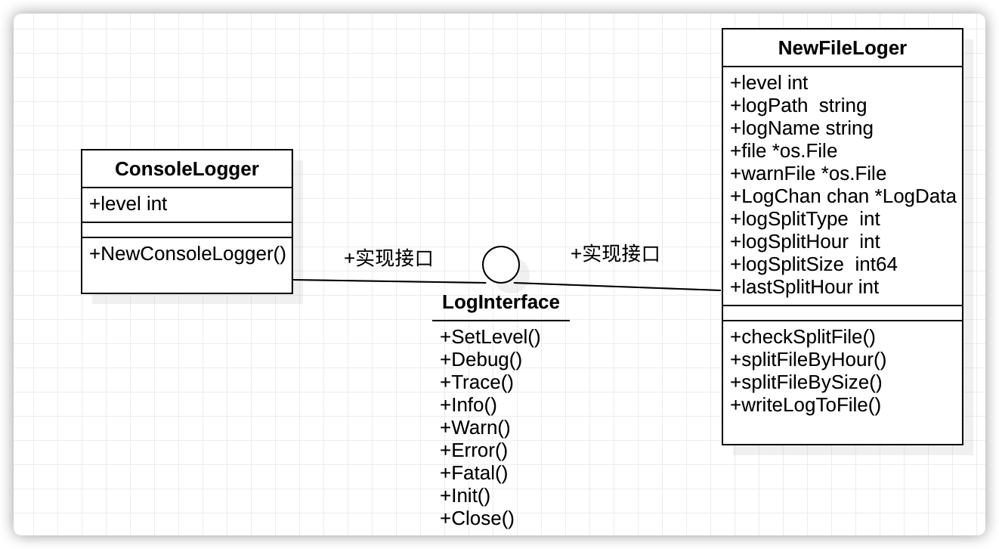

# 简介
logger包是一个golang实现的日志模块，有如下功能
- 支持日志写入文件，按时间或者文件大小分割日志文件，避免单个文件过大
- 支持日志打印到终端
- 支持日志分等级打印，有Debug Trace Info Warn Error Fatal 6个级别
- 支持打印消息，时间，等级，文件名，方法名，行号
## 使用方式
- 使用终端打印
```golang
import "github.com/Curricane/logger"

//进行初始化
err =: logger.InitLogger("console", map[string]string{"log_level": "info"})
if err != nil {
    // todo
}
logger.Info("hi, i am %s", "info")
```
- 使用打印到文件功能
```golang
import "github.com/Curricane/logger"
config := map[string]string{
	"log_path":       "./",
	"log_name":       "file_log",
	"log_level":      "info",
	"log_split_type": "hour", // optional default hour
	"log_split_size": "",     // optional default 104857600 即100M
	"log_chan_size":  "",     // optional default 50000
}
err := logger.InitLogger("file", config)
if err != nil {
    // todo
}
logger.Info("hi, i am %s", "info")
```
## 接口
- `func InitLogger(name string, config map[string]string) (err error)`
> 初始化日志，选择文件模式，还是终端模式
- `func Debug(format string, args ...interface{})`
- `func Trace(format string, args ...interface{})`
- `func Info(format string, args ...interface{})`
- `func Warn(format string, args ...interface{})`
- `func Error(format string, args ...interface{})`
- `func Fatal(format string, args ...interface{})`
- `func SetLevel(level int)`
> 设置打印级别
## 设计

## 细节
- 通过runtime包获取函数名，行号，文件名
```golang
func GetLineIfo() (fileName string, funcName string, lineNum int) {
	var skip int = 4 //栈帧
	pc, file, line, ok := runtime.Caller(skip)
	if ok {
		fileName = file
		funcName = runtime.FuncForPC(pc).Name()
		lineNum = line
	}
	return
}
```
- 通过channel充当消息队列，在不断循环过程中检测日志文件大小/时间间隔
```golang
func (f *FileLogger) writeLogToFile() {
	if f.LogChan == nil {
		return
	}

	for logData := range f.LogChan {
		if logData.LevelStr == "fatal" ||
			logData.LevelStr == "warn" ||
			logData.LevelStr == "error" {
			f.checkSplitFile(true)
			fmt.Fprintf(f.warnFile, "%-24s %-6s (%-14s:%-14s:%-5d) %s\n",
				logData.TimeStr, logData.LevelStr, logData.Filename,
				logData.FuncName, logData.LineNum, logData.Message)
			continue
		}
		f.checkSplitFile(false)
		fmt.Fprintf(f.file, "%-24s %-6s (%-14s:%-14s:%-5d) %s\n",
			logData.TimeStr, logData.LevelStr, logData.Filename,
			logData.FuncName, logData.LineNum, logData.Message)
	}
}
```
## 有待改进的地方
- 增加更人性化的默认配置，而不是通过config
- 一些字符串用常量代替